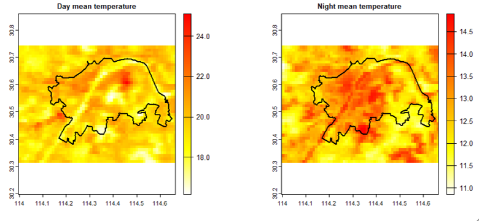
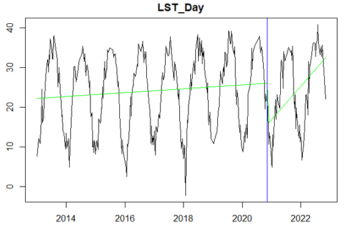
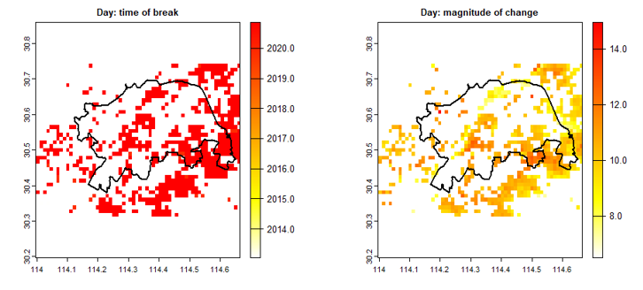
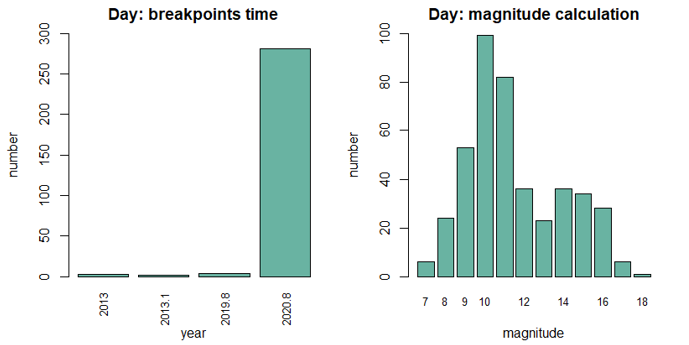

### Project 1: Urban Surface Temperature Change

  <figure>
    
    
    
    
  </figure>

This study investigates the impact of the COVID-19 epidemic on land surface temperature (LST) in Wuhan's central city.

Using MODIS LST data from 2013 to 2023 (resource from: [Google Earth Engine](https://earthengine.google.com/)), and applying the [BFAST algorithm](https://cran.r-project.org/web/packages/bfast/bfast.pdf) in [R](https://www.r-project.org/) for time series analysis, the study identifies significant breakpoints in LST during the 2020 urban lockdown, revealing reductions in urban surface temperature. These changes are attributed to decreased human activity and energy consumption, highlighting a temporary mitigation of the urban heat island effect.

### Project 2: land cover classification: mechine learning algorithm

under construction

### Project 3: Land objects classification: deep learning

under construction
