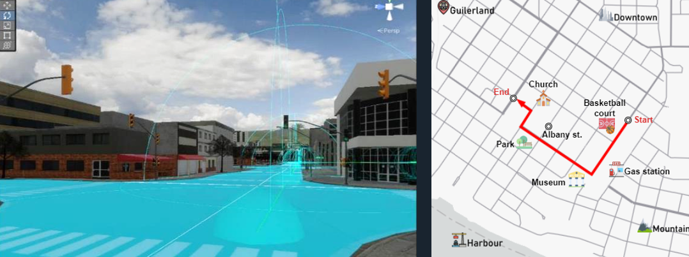
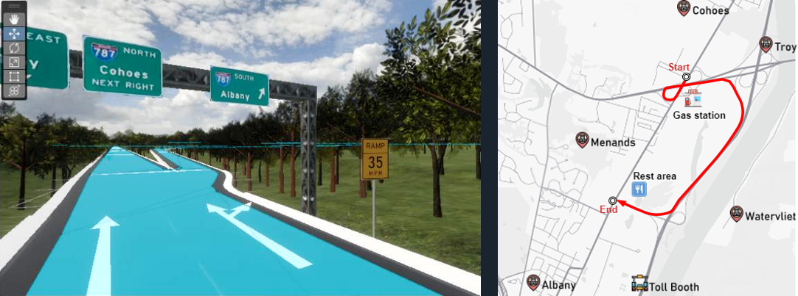

# Virtual Reality Simulated Augmented Reality Display on Windshields: Improving the Spatial Awareness of Autonomous Car Drivers

  <video width="540" height="310" controls>
    <source src="../videos/xr-autodriving4scenes.mp4" type="video/mp4">
  </video>
  <figure>
    
    
  </figure>

### Abstract

The emergence of autonomous driving technology gradually facilitates the shift towards self-driving vehicles, altering the role of drivers and transitioning them from active operators to passive observers, which may impact their spatial cognition and decision-making abilities. This study leverages virtual reality (VR) to create a simulated autonomous driving experience, integrating augmented reality (AR) displays that present spatial information through distant and local landmarks. The objective is to assess how drivers interact with and process AR-enhanced spatial cues in a virtual autonomous driving context. Building upon R. Li's research (2023), this study employs a two-by-two experimental design to investigate the effects of road type and AR landmark conditions on spatial knowledge acquisition. Eye-tracking data collected via the VR headset is analyzed to examine variations in gaze behavior under different experimental conditions in five windshield areas. Additionally, the study compares immersive VR-based results with those from R. Li's original online video-based research (2023) to evaluate the consistency and reliability of findings. The results indicate that the AR display with landmark information enhances spatial knowledge acquisition. Regarding road type, participants on the highway took more time to comprehend spatial layouts but achieved higher accuracy compared to those on the local road AR landmarks displayed on the top and bottom areas of the windshield attracted more attention than the right edge windshield area during VR experiments, as evidenced by increased average fixation duration, fixation count, and dwell time (which are eye-tracking metrics). Conversely, compared to the AR absent condition, adding AR landmarks reduced the frequency of gaze focus on the right edge of the windshield with less dwell time and lower fixation count. The route and configurational knowledge task accuracies produced consistent results in in-person VR and video-based online research. For directional knowledge, the VR experiment revealed higher accuracy than the online video experiment. The research findings guide future research in enhancing the integration of AR in autonomous driving, with a focus on improving safety, spatial awareness, and the overall user experience.

### Project link:

[virtual-reality-simulated-augmented-reality-display-on-windshields-improving-the-spatial-awareness-of-autonomous-car-drivers](https://www.wur.nl/en/activity/virtual-reality-simulated-augmented-reality-display-on-windshields-improving-the-spatial-awareness-of-autonomous-car-drivers.htm)
