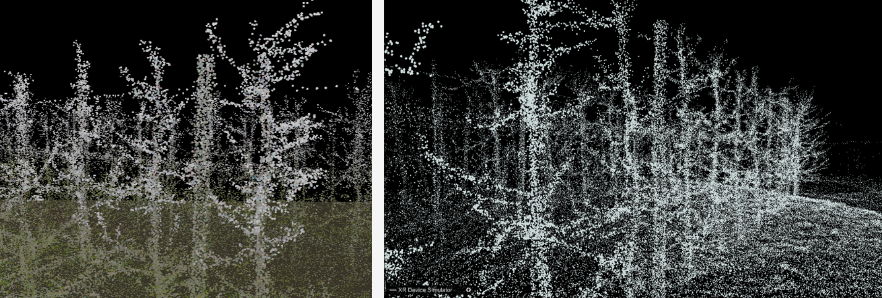
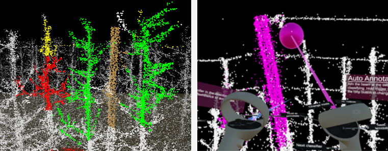

This project is developed with Unity and Cloud Compare, using C# and Python. The full title for this XR project is:

***Implementing a Virtual Reality Tool using Color Point Cloud for Automatic Annotation Suggestions***

**(Project confidentiality belongs to** [OnePlanet Research Center](https://www.oneplanetresearch.nl/)**)**

The demostration of the project includes three parts, to protect the copy right, only show the screenshot of project:

1. The visualization of the orchard LiDAR scanned data.

  

2. Automatic annotation tool with auto-segementation suggestion (pre-defined the catogories in Unity).

  
