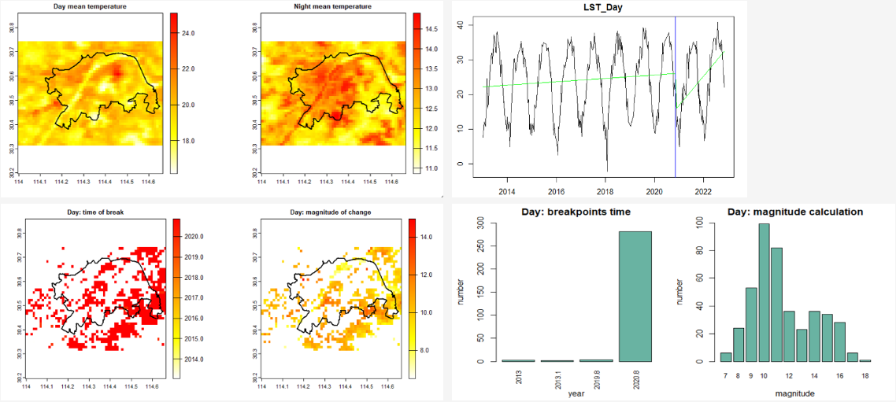
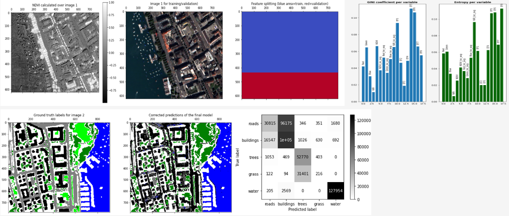
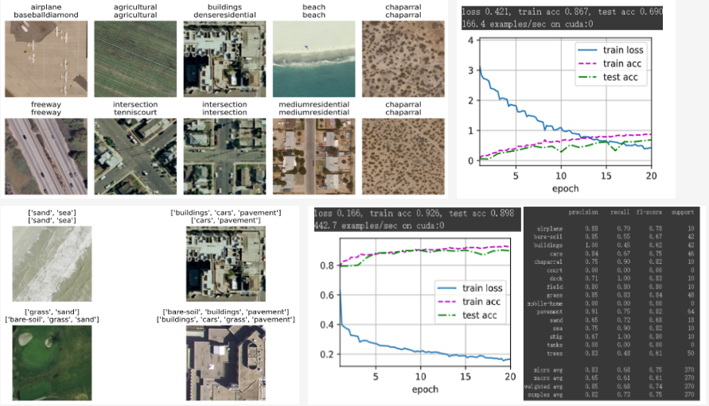
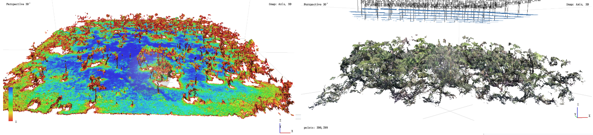
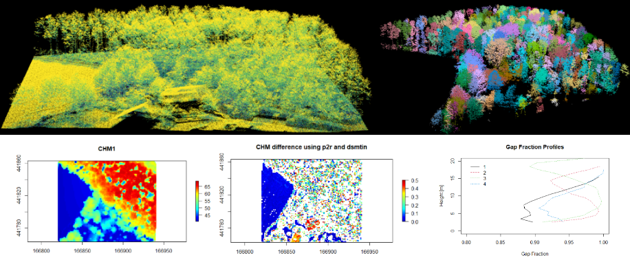
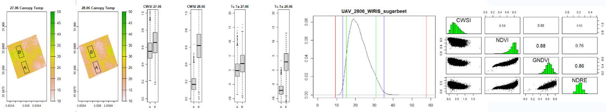

Welcome to my remote sensing projects, where I explore innovative techniques for analyzing and understanding the Earth's surface. These projects showcase applications of advanced tools and algorithms to address real-world challenges.

Each project combines cutting-edge methods with geospatial data to provide meaningful insights into environmental and urban dynamics.

---

### Project 1: Urban Surface Temperature Change Time Series Analysis

This study investigates the impact of the COVID-19 epidemic on land surface temperature (LST) in Wuhan's central city.

Using MODIS LST data from 2013 to 2023 (resource from: [Google Earth Engine](https://earthengine.google.com/)), and applying the [BFAST algorithm](https://cran.r-project.org/web/packages/bfast/bfast.pdf) in [R](https://www.r-project.org/) for time series analysis, the study identifies significant breakpoints in LST during the 2020 urban lockdown, revealing reductions in urban surface temperature. These changes are attributed to decreased human activity and energy consumption, highlighting a temporary mitigation of the urban heat island effect.

### Project 2: Land Cover Classification with Random Forest

This project involves a **machine learning** algorithm for remote sensing: classifying satellite images into land cover types on a per-pixel basis over Zurich, Switzerland.

Using a [Python](https://www.python.org/) implementation of the Random Forest classifier, we will process Image 1 by extracting band features and calculate metrics to train the classification model for various land cover classes. The trained model will then predict land cover types in Image 2, demonstrating the application of supervised classification in remote sensing analysis.

### Project 3: Land Use Classification with AlexNet and ResNet

This project explores land-use classification using satellite images from the [UCM Dataset](https://paperswithcode.com/dataset/uc-merced-land-use-dataset), leveraging **deep learning** techniques in [Python](https://www.python.org/).

The study includes two tasks: (1) single-label classification, assigning a general category to each image, and (2) multi-label classification, identifying multiple features within each image to determine detailed land-use classes.

CNN models AlexNet and ResNet are employed to extract features and achieve high classification accuracy.

### **Project 4: Processing and analyzing UAV data with Photogrammetry**:

This project focuses on creating accurate 3D models from UAV data using **photogrammetry** with [Agisoft](https://www.agisoft.com/). Inconsistent side-lapping rates result in gaps and reduced model accuracy due to insufficient image overlap. The analysis identifies these gaps and emphasizes optimizing flight paths and overlap for improved 3D reconstruction.

### **Project5**: Individual Tree Segmentation for LiDAR data

This project involves segmenting individual trees from **LiDAR** data using an algorithm implemented in [R](https://www.r-project.org/). The method effectively separates trees in a forest, with point clouds accurately reflecting tree shapes. However, closely aligned trees present challenges in defining canopy boundaries, leading to inaccuracies in segmentation. In some cases, individual trees are incorrectly divided into multiple segments.

### **Project6**: **UAV thermography**

This project uses UAV thermography to analyze canopy temperature changes in [R](https://www.r-project.org/) and [Erdas Imagine](https://hexagon.com/products/erdas-imagine). Both regions show temperature reductions, with a more significant change observed in region A, as indicated by color shifts in the left graph. The results demonstrate that fully-transpiring plants, with higher moisture levels, exhibit lower canopy temperatures compared to non-transpiring plants.

