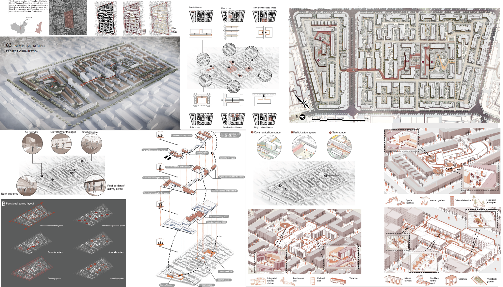
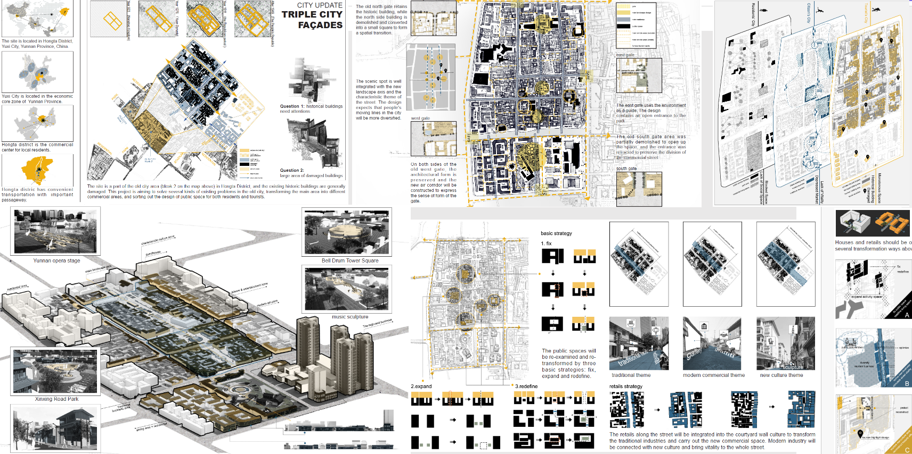

Welcome to My Urban Planning Portfolio

Thank you for visiting! This section showcases my work and passion for creating sustainable and vibrant communities. My portfolio highlights my ability to integrate technical expertise with creative problem-solving, whether through **GIS analysis**, **3D modeling**, or **policy development**. Each project represents my commitment to designing solutions that balance social, environmental, and economic goals.

Feel free to explore and reach out if you'd like to discuss my work or potential collaborations.

---

### **Project 1: Xi'an Living Community Urban Renewal**

This project is a reconstruction scheme for the improvement of living environment in the old industrial zone of Xi'an under the background of urban renewal, based on the relevant principles of environmental psychology. On the basis of considering the daily activities of the elderly, improve the physical environment, safety and comfort of residents' life. At the same time, we have increased the functionality of the relevant clusters

The base is located in Tianshan District of Urumqi,Tianshan District is a relatively developed district in Urumqi. *Project maps were conducted by using ArcGIS Desktop, AutoCAD, and Adobe Creative Suite. Project presentation was achieved by Microsoft 365.*

### **Project 2: Yuxi Old City Center Update**

The site is located in Hongta District, Yuxi City, Yunnan Province, China. The site is a part of the old city area (blcok 2 on the map above) in Hongta District, and the existing historic buildings are generally damaged. This project is aiming to solve several kinds of existing problems in the old city, transforming the main area into different commercial areas, and sorting out the design of public space for both residents and tourists.




  
